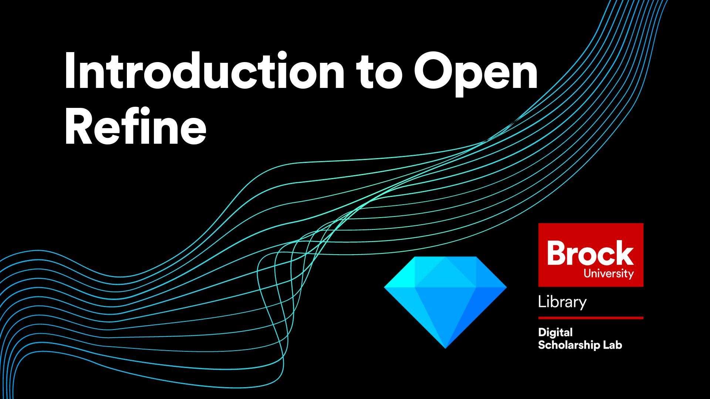

# Introduction to Open Refine
This workshop is meant to give you a basic foundation on how to use the tool and navigate the interface.  It will cover:
- How to run the Open Refine tool
- How to use the Facet and Filter features to identify errors
- How to split and join columns of your data
- How to use GREL commands on your data
- And how to export your data back out of Open Refine

## Setup Instructions
In preparation for this workshop, you will need to download and unzip the Open Refine package. The steps to do this are:
- Go to the [downloads page for Open Refine](https://openrefine.org/download.html)
- Click the Highlighted text that represents your operating system (If you are using windows and are unsure if you have java, choose the option that comes with Java)
- Save the file to your computer in a location that you have access to
- Unzip the file using your preferred zipping tool (right click on the folder and choose the program to unzip with like 7zip or WinZip)
- (Optional) Make a shortcut on your desktop by opening the folder, right clicking openrefine.exe (blue gem symbol) and  clicking "create shortcut"

You will also need to download the dataset for the workshop found [HERE](https://github.com/BrockDSL/Introduction-to-Open-Refine/blob/master/Book%20list%201.xlsx)

## Helpful Materials
Add in any helpful resources, code snippets, cheat sheets, or other relevant information here.

## Follow Up Material
Add in names of books, links to websites, or any other reccomendations for follow up materials that could represent the "Next Step" in an attendees learning after the workshop.  helpful links like the Programming Historians or W3Schools are good examples.

 
 
 

  
**This workshop is brought to you by the Brock University Digital Scholarship Lab.  For a listing of our upcoming workshops go to [Experience BU](https://experiencebu.brocku.ca/organization/dsl) if you are a Brock affiliate or [Eventbrite page](https://www.eventbrite.ca/o/brock-university-digital-scholarship-lab-21661627350) for external attendees.**

